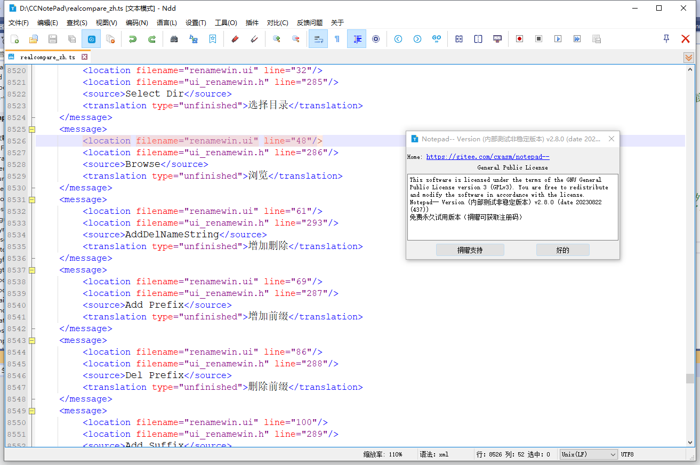
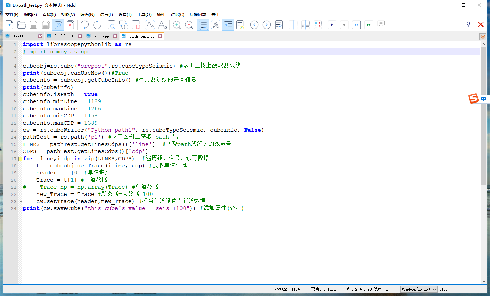
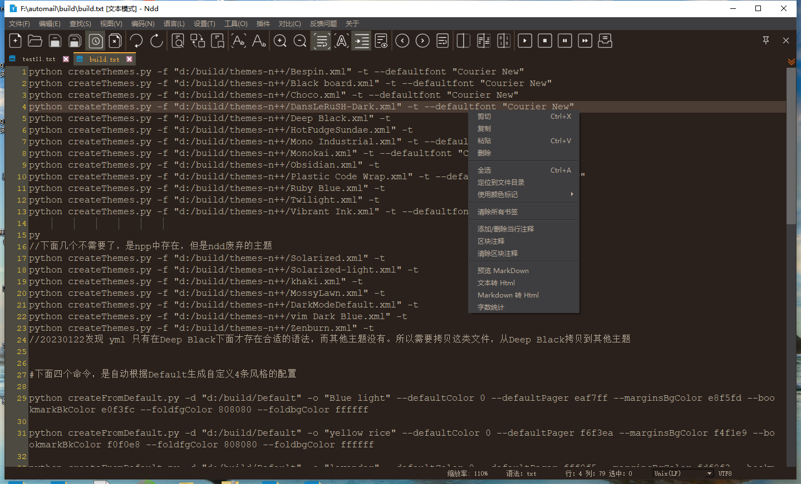
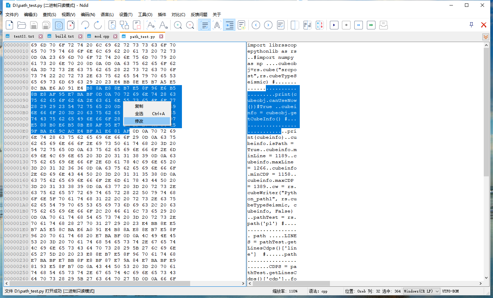
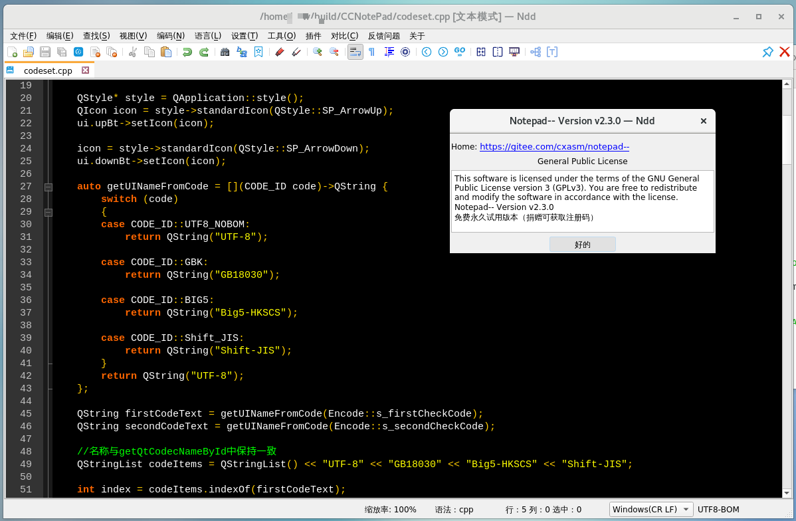
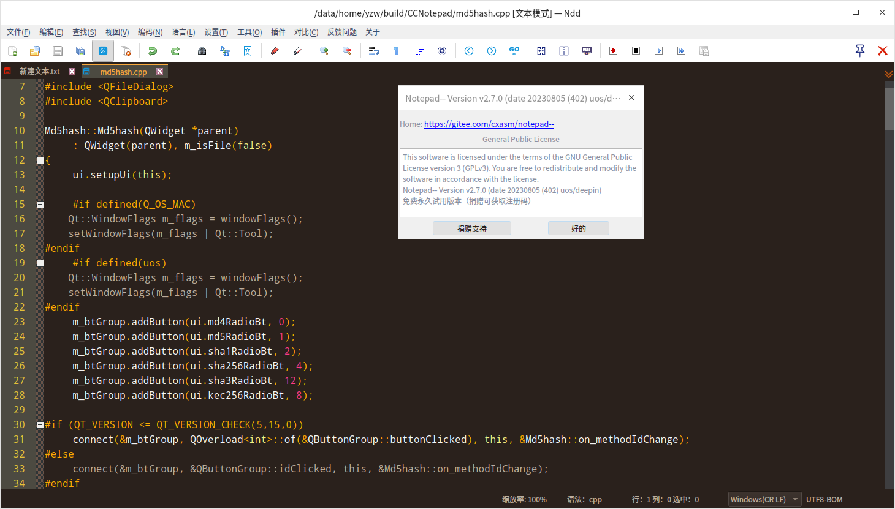
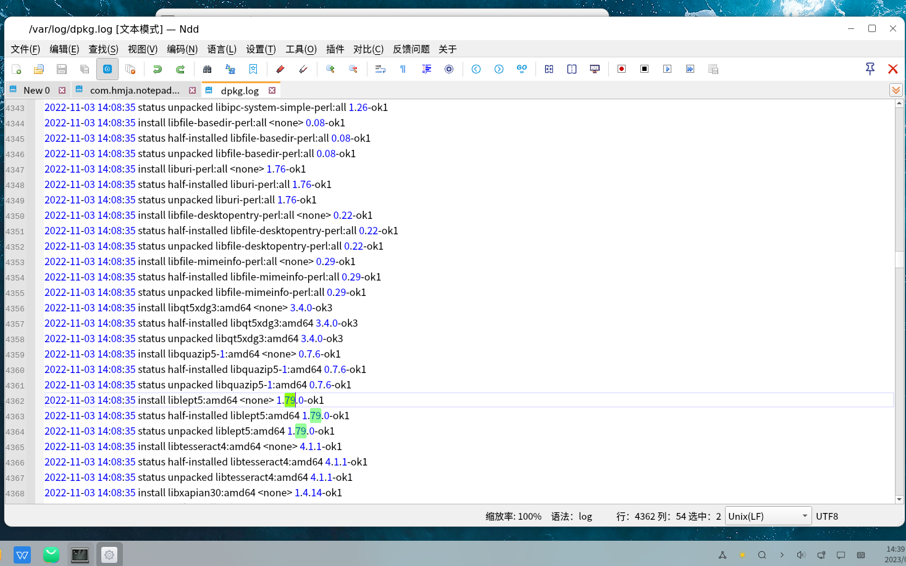

# notepad--

[中文 ](README.md) | [English](README_EN.md)

## 项目简介

Notepad-- 是使用C++编写的轻量级文本编辑器, 简称ndd, 可以支持Window/Mac/Linux操作系统平台。

我们的目标：完成文本编辑类软件的国产可替代，重点在国产Uos/Linux系统、Mac 系统上发展。

对比其它竞品Notepad类软件而言，我们的优势是可以跨平台，支持linux mac操作系统。

 **鉴于某些Notepad竞品作者的不当言论，Notepad--的意义在于：减少一点错误言论，减少一点自以为是。** 

 **Notepad--的目标，致力于国产软件的可替代，专心做软件。**

您可以在这个项目提交bug或反馈问题。

最新版本下载地址：https://gitee.com/cxasm/notepad--/releases/latest

NDD 具备插件编写功能，如果您愿意开发插件，还请提交给我们。

做国人自己的免费编辑器，离不开您的支持，请通过微信捐赠我们。

## 联络方式

QQ群：372613546(已满） 959439826(已满）728578708（空闲） 用户群，做NDD的问题反馈、功能建议等。

QQ群 616606091 开发群，建议懂CPP/QT、愿意参与NDD项目代码贡献的开发人士加入。

## 编译
见build目录下文档 linux开源编译及下载说明.txt

## 效果预览

 **windows效果图：** 

 **MacOS 效果图：** 

 **Redhat7.x 效果图：** 

 **UOS 深度 效果图：** 

 **麒麟openkylin 0.9 x64 效果图：** 
