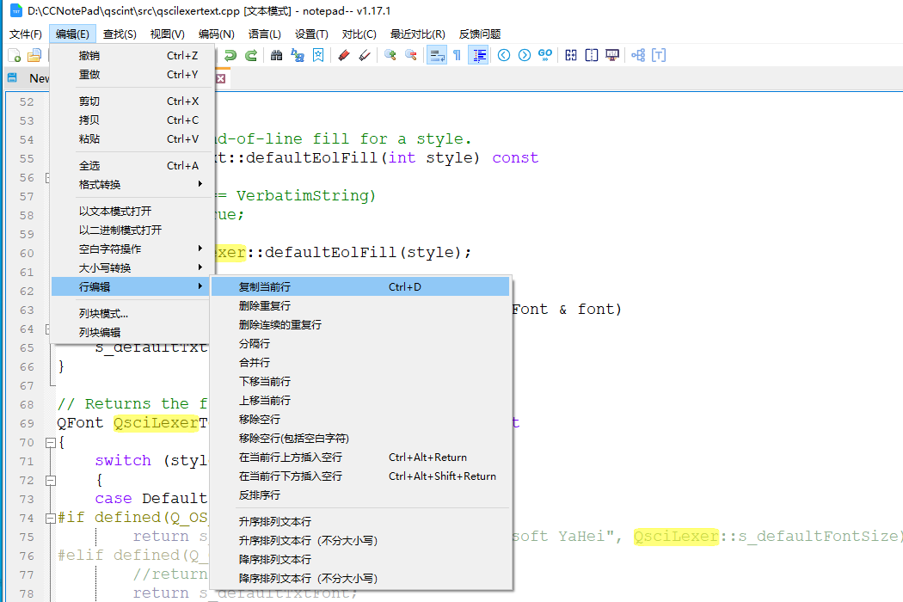
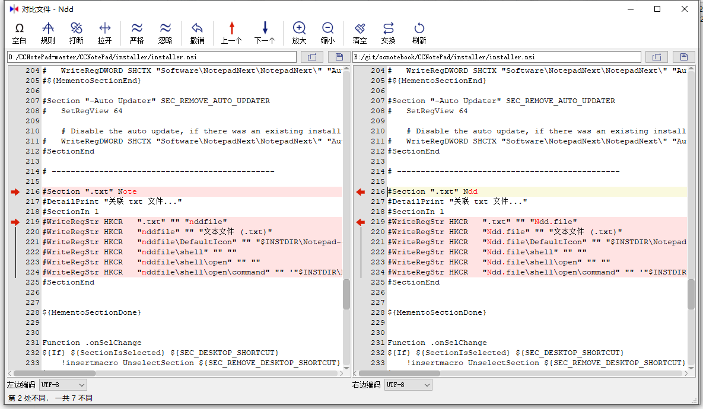
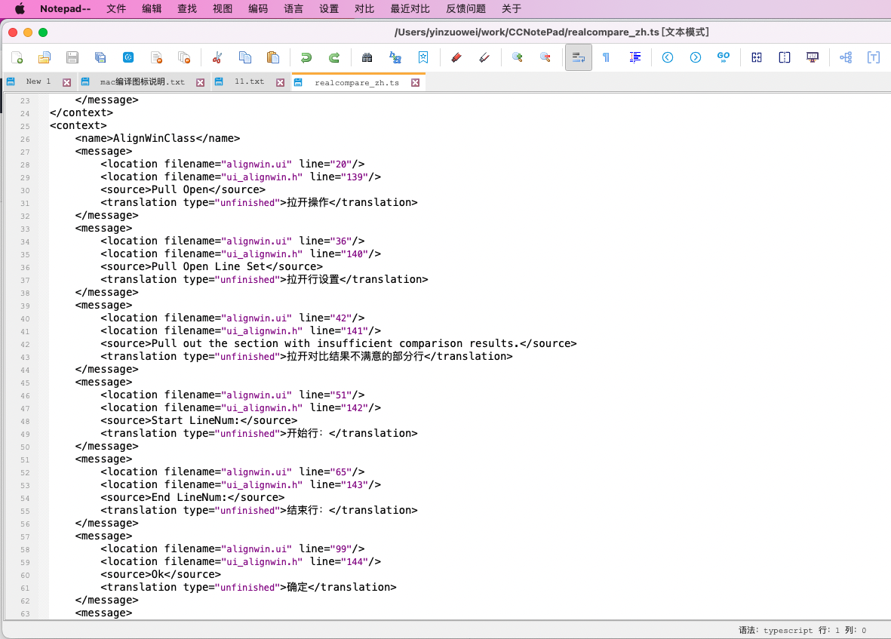
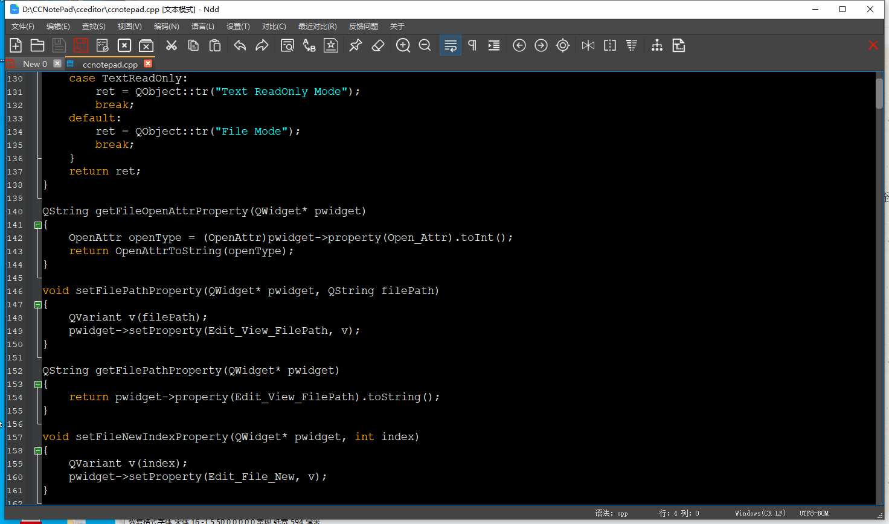

# Notepad--

[中文 ](README.md) | [English](README_EN.md)

## Project Introduction

Introducing Notepad-- a text editor written in C++ that works seamlessly across Windows, Linux, and Mac platforms. Our goal is to eventually surpass Notepad++, with a special focus on the Chinese UOS operating system. Unlike Notepad++, our advantage lies in our cross-platform compatibility and support for different operating system.

**The purpose of Notepad-- is to counteract some of the misleading statements made by the author of Notepad++ and to promote a more humble and grounded perspective.** 

If you come across any bugs or have any feedback, feel free to let us know.

You can download the latest version from https://gitee.com/cxasm/notepad--/releases/tag/v2.0.

We have recently added the ability to write plugins to Notepad-- and we hope that many CPP/QT developers will join us in this endeavour. If you develop a plugin, you can include your name and a donation channel.

Creating a free text editor requires support from users like you. If you'd like to contribute, please consider donating via WeChat.


## Compilation

**CMake Toolchain Compilation Instructions:**

- Ubuntu/Debian

1. Install compilation environment `sudo apt-get install g++ make cmake`
1. Install qt tools and libraries `sudo apt-get install qtbase5-dev qt5-qmake qtbase5-dev-tools libqt5printsupport5 libqt5xmlpatterns5-dev `
1. Configure `cmake -B build -DCMAKE_BUILD_TYPE=Release`
1. Compile `cd build && make -j`
1. Package `cpack`

- ArchLinux

1. Install compilation environment `sudo pacman -S gcc cmake make ninja`
1. Install qt tools and libraries `sudo pacman -S qt5-tools qt5-base qt5-xmlpatterns `
1. Configure `cmake -S . -Bbuild -GNinja -DCMAKE_BUILD_TYPE=Release  -DCMAKE_INSTALL_PREFIX=/usr -W no-dev`
1. Compile `ninja -C build && ninja -C build install`
1. Package: use [AUR/notepad---git](https://aur.archlinux.org/packages/notepad---git) `yay -S notepad---git`
1. Installation:
    - Pre-compiled package add [ArchLinuxCN/notepad---git](https://github.com/archlinuxcn/repo) mirror `yay -S archlinuxcn/notepad---git`
    - Pre-compiled package [Debuginfod/notepad---git-debug](https://wiki.archlinux.org/title/Debuginfod) package `yay -S archlinuxcn/notepad---git-debug`

**Qt Project Compilation Instructions:** 

1) Start by opening qscint/src/qscintilla.pro in either Qt Creator or Visual Studio and compile the qscintilla dependency library.

2) Next, open RealCompare.pro and compile it after loading.

3) Due to the multi-platform compilation, involving Windows/Linux/MacOS, if there are any compilations or problems, please join qq group 959439826. We welcome contributions and code submissions from everyone.

Recently, the code was made available online. However, the commercial comparison function and registration function have been removed for commercial reasons. All other functions have been retained.

4) For Arch Linux and its derivatives, you can install Notepad-- through the AUR using the following command: [notepad---git](https://aur.archlinux.org/packages/notepad---git)
```
yay -S notepad---git
```

## Preview








